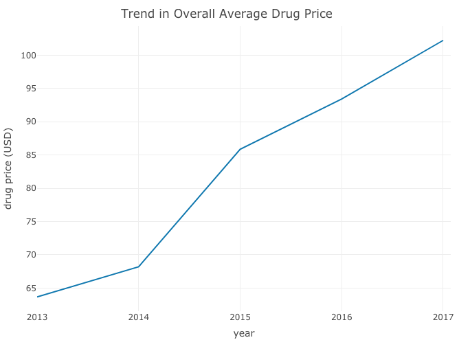

High drug prices have become an increasing concern in the United States (Hancock, 2016 ; "Why Prescription Drugs...”, 2017).  In 2016, 1 in 5 Americans reported taking four or more prescription drugs (“Public Opinion on Prescription…”, 2016). 

This project aims at  exploring factors associated with US prescription drug prices.  Those factors include disease research funding, drug need (prevalence), sales, and advertising. 

### Plot showing trend in rising price

### Further Explore How Various Factors Affect Drug Prices

* [Raw Datasets](data.html)
* Versions of [R and Packages](rpackage.html) used in Analysis
* [References](references.html)

### Watch this video for a tour of our website:  <iframe width="560" height="315" src="http://www.youtube.com/embed/9bZkp7q19f0?rel=0" frameborder="0" allowfullscreen></iframe>

